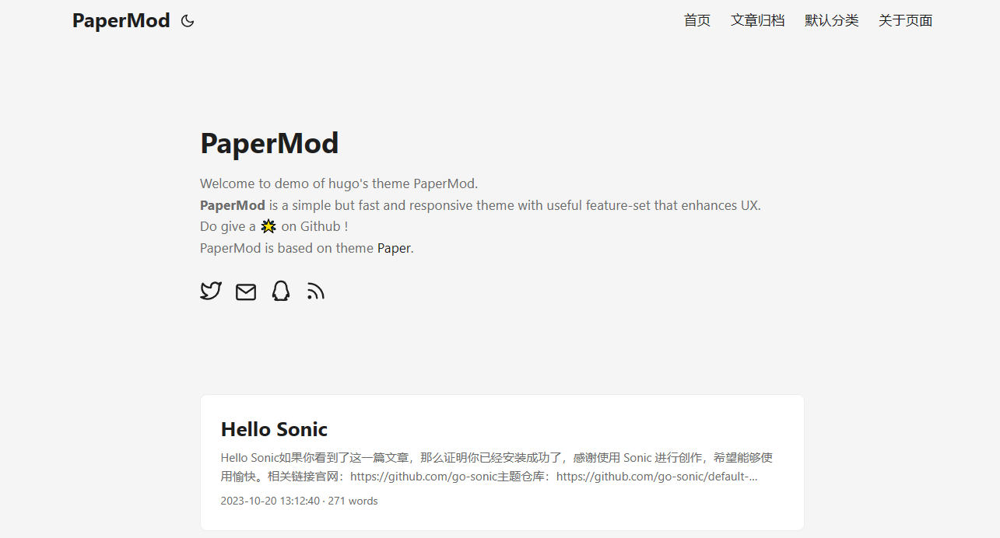

<h1 align=center>Sonic PaperMod</h1>

<h4 align=center>☄️ Fast | ☁️ Fluent | 🌙 Smooth | 📱 Responsive</h4>

---

Sonic PaperMod is simple, fast and responsive theme with light/dark mode, based on [hugo-papermod](https://github.com/adityatelange/hugo-PaperMod).

[Sonic](https://github.com/go-sonic/sonic) is a blogging platform developed by Go. Simple and powerful.

---

  

---

## Install 📥

1. Go to `Admin` -> `Appearance` -> `Theme.`
2. Click the `Install Theme` button, then select `Remote Pull`.
3. Paste the link `https://github.com/jakezhu9/sonic-theme-papermod`, and click `Download`.
4. Activate the theme and enjoy it.

---

## TODO (Welcome contribute!) 📝

- [ ] support search
- [ ] support comment
- [ ] support code highlight
- [ ] more custom options
- [ ] ...

---

## License 📜

The MIT License (MIT)
